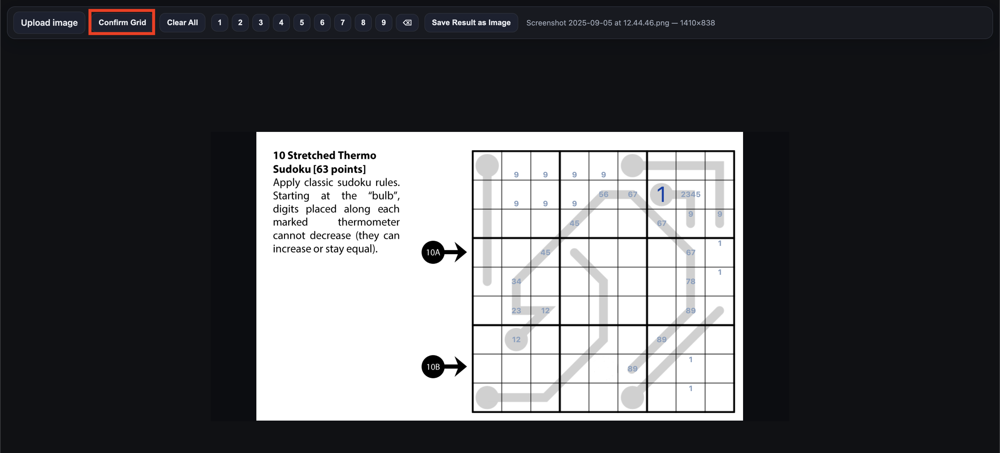
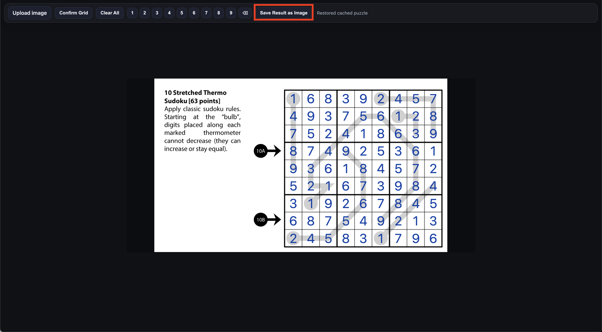
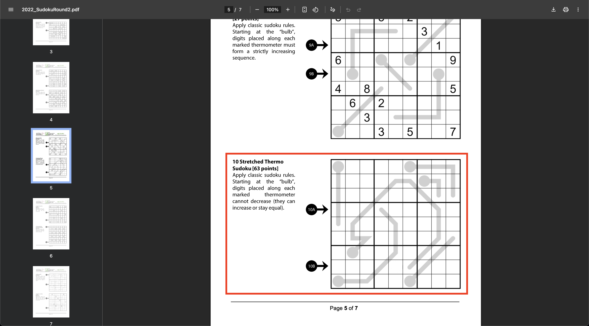
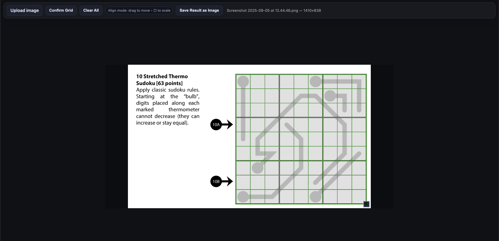
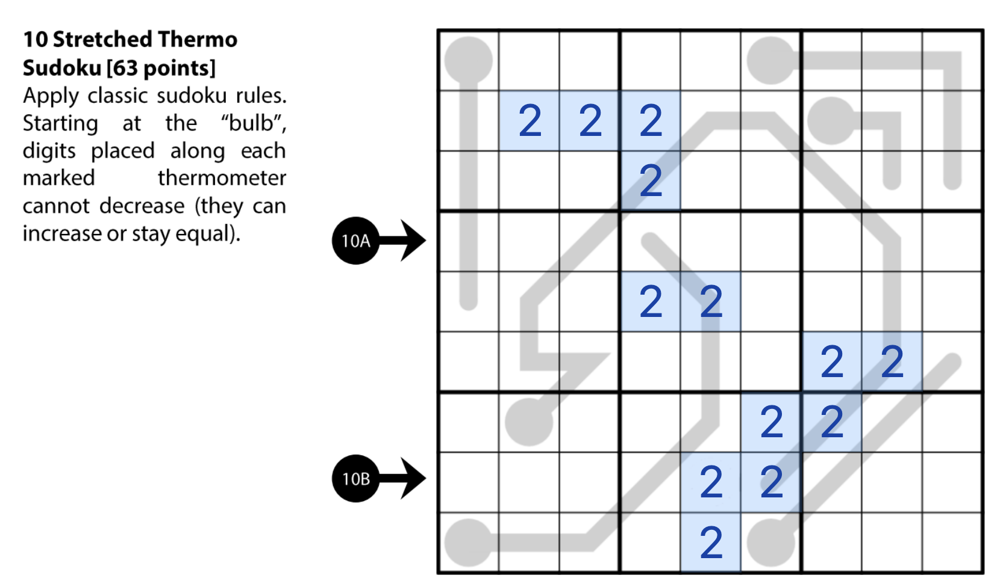

# SudokuImporter
If you come across a Sudoku in a PDF or without an interface for punching in numbers and hints, or if you come across a Sudoku with an interface you don't like, this may be helpful! This tool may be useful for ease of use, consistent hint interface for every puzzle you want to import and solve, and offering 3 rows of hints by default (sites typically only allow 1 row of hints).

Simply screenshot your Sudoku, import it into the webpage, align the 9x9 Sudoku grid, and get to solving.

Quick gallery overview

## How to use
If you enjoy solving puzzles from Sudoku World Puzzle Federation (WPF), but don't want to bother with printing out the puzzles and solving them manually, you can follow these steps to add an overlay for easier solving.

1. Find a puzzle you'd like to solve and screenshot it. Here's I'm using Sudoku WPF 2022 Round 2 puzzle 10 ([click "Competition Puzzles" here](https://gp.worldpuzzle.org/content/competition-puzzles-96)).

2. Open up the Sudoku Importer and upload the screenshot

3. With the green grid overlay, align it over the sudoku. (Use the square on the bottom right to resize the grid, and drag the grid around for aligning)

4. Once aligned, press "Confirm Grid" and start solving. For control hotkeys, refer to the next section.

5. Once finished, press "Save Result as Image" to save the final result!

## Controls

Click any cell to highlight it
- [1] Digits 1-9 on the keyboard to fill in a solved number
- [2] Shift + number to fill in a hint on the top row of the cell
- [3] Windows: Ctrl + number, Mac: Ctrl/Cmd + number to fill in a hint on the middle row of the cell
- [4] Q + number to fill in a hint on the bottom row of the cell

You can also highlight multiple cells at once using ctrl, cmd (for mac), or shift to click and drag. Use the above controls to edit multiple cells at once

## Miscellaneous Notes
This was coded with the help of ChatGPT, so the code may look a little funky - I am a bit lazy to clean it up so if someone wants to do it (or improve the page), feel free to submit a pull request! There are definitely some improvements to be made such as page refreshing, window resizing, etc.

This is also done in a singular HTML page for ease of portability and setup. If you would like to use this offline, simply download the HTML file (or copy it) and store it somewhere on your computer. If you need help doing so, ask ChatGPT!

Hope you enjoy this tool, and happy Sudoku solving!